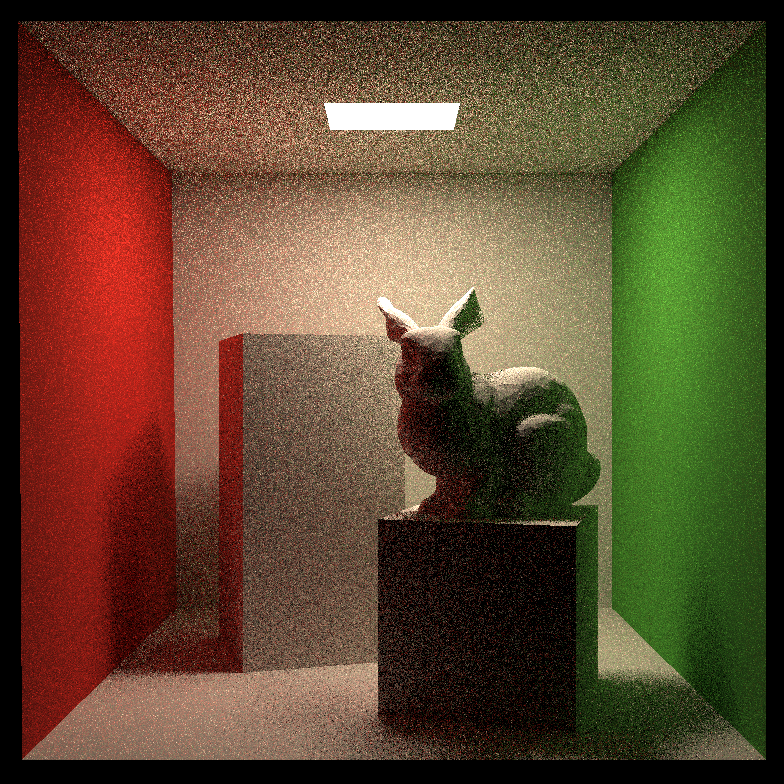
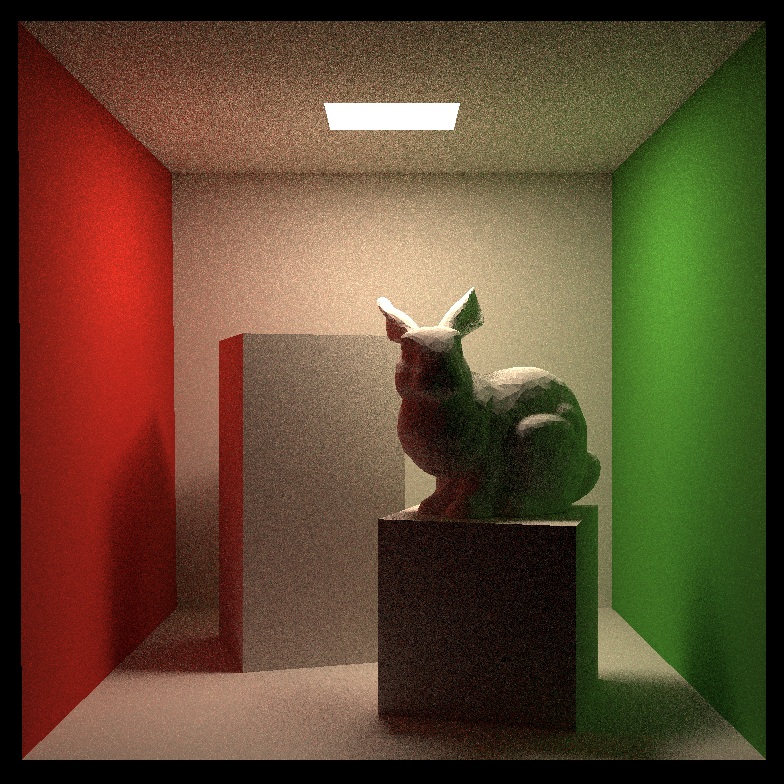

# Brownie Renderer

$$
L_o(x_0, \omega_0) =
\sum_{n=1}^{\infty}
\int_{\Omega}
\cdots
\int_{\Omega}
L_e(x_n \rightarrow x_{n-1})
\prod_{i=1}^{n}
f_r(x_i, \omega_{i+1}, \omega_i)\,
G(x_i \leftrightarrow x_{i-1})\,
d\omega_1 \cdots d\omega_n
$$

<p align="center">
  <em>Brownie Renderer: A Parallelized Path Tracing Light Transport Simulator</em>
</p>

<p align="center">
  
</p>

布朗尼渲染器：高质量多核路径追踪渲染器。

本渲染器的目标是成为一个轻量化、可扩展的基于物理的高性能渲染器，在接近实时渲染的低采样率下达到最佳效果。

## Features
- **无限次反弹路径追踪**
- **低采样高收敛**
- 完美的漫反射表面渲染
- 自定义渲染质量
- 多核心并行加速

## 准备做的
- 进一步的采样优化
- ReSTIR 蓄水池时空重要性重采样算法
- 自定义场景
- 多种材质支持
...等等。

## 当前的低采样效果
|  |  |  |
|:--:|:--:|:--:|
| 2 spp | 4 spp | 16 spp |

## 构建
### on Windows 11 (x86-64)
**你需要安装**：
- Windows Subsystem for Linux 2 (WSL 2)
  - 🐧安装一个 Linux 发行版（Arch Linux, Ubuntu, etc.）
-  JetBrains CLion

接着，在 Linux 下安装必要的 C++ 开发工具（CMake, 编译器等）：
```shell
sudo apt install build-essential
unzip cmake
```

在 CLion 里的 **设置** 中找到 **构建、执行、部署**，在工具链页里将 WSL 拉到最上面（会显示“默认”）。

请确保此时**工具集**、**CMake** 和**调试器**都处于 ✔ 的状态。

在根目录运行以下命令进行构建：
```shell
mkdir build
cd ./build
cmake ..
make
```

## 运行
```shell
./RayTracing
```

